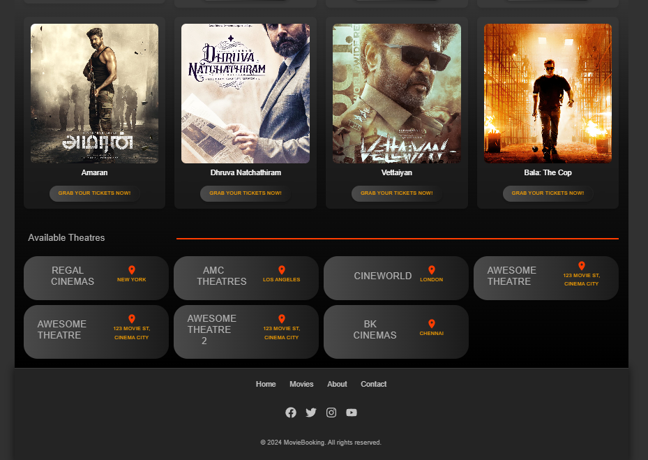

# 🎬 Movie Booking App

The **Movie Booking App** is a comprehensive platform built to provide users with a seamless experience of browsing, booking, and managing movie tickets. It includes features for user bookings, seat selection, payment processing, admin controls, and automated email confirmations.

---

## 📸 Project Showcase

### Homepage

Explore the homepage with a welcoming design that provides quick access to movies, theatres, and featured content.


### Extended Homepage

See more featured content and movies available at your fingertips.



### Movies Gallery

Browse a selection of movies, each with detailed information on genre, rating, and availability.


### Movie Details

Dive deeper into the movie details page, where you can see trailers, descriptions, and other important details to help you choose.


### Theatres List

View a list of theatres showing your selected movie, complete with location and timing options.


### Theatre Seat Booking

Choose your preferred seats in an interactive seat selection interface for a smooth booking experience.


### Payment Confirmation Page

Confirm your booking details and prepare for payment in a user-friendly payment confirmation page.


### Payment Screen

Make secure and straightforward payments through our payment gateway.


### Profile Page

Check your booking history, view upcoming reservations, and manage your profile settings all in one place.


### Admin Dashboard

Admins have full control with a dashboard to manage movies, theatres, schedules, and more.


### Email Confirmation

After booking, receive a confirmation email with all the necessary details about your reservation.


---

## 🚀 Getting Started

### Prerequisites

- Node.js
- npm

### Installation

1. Clone the repository:

   ```bash
   git clone https://github.com/Balakrishnan0516/MovieBookingApp.git
   ```
